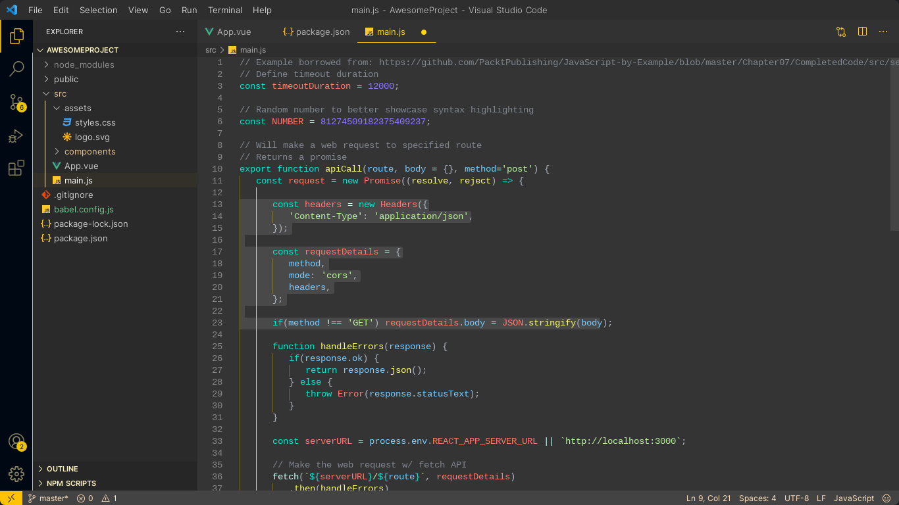

# Super Saiyan Theme - Dark

  

  

A simple Visual Studio Code theme for Yellow and Dark color lovers

## Screenshots

## Installation

- Go to [VScode Marketplace](https://marketplace.visualstudio.com/items?itemName=CMarghin.super-saiyan-theme)
- Click on the Install button
- After installation, click on the theme in the list and select it
- Enjoy :)

## Override Theme and Contributon.

If you want to override some of the colors, please follow the instructions in [color theme documentation](https://code.visualstudio.com/api/extension-guides/color-theme). Or if you want to make this theme better for everyone, you can contribute to the [repository](https://github.com/CH4R4F/Super-Saiyan-Theme) and send me a pull request =)
